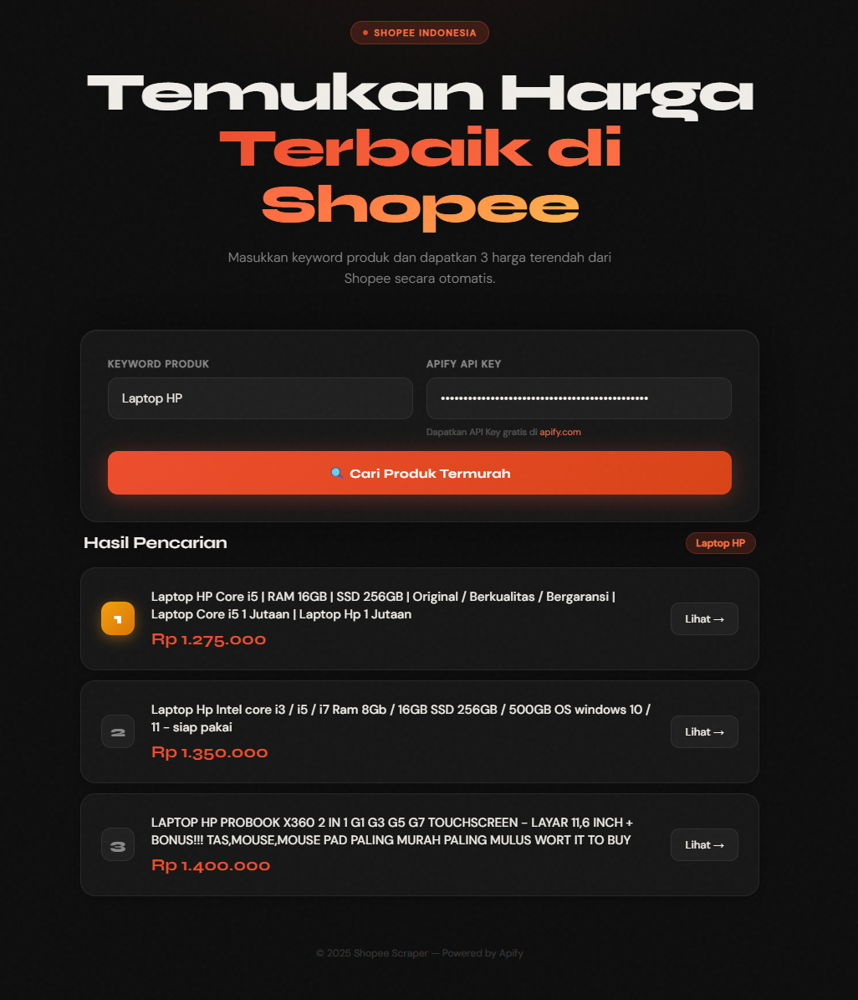

# 🛒 Shopee Scraper With Apify — Web App

Aplikasi web scraping produk **Shopee Indonesia** berdasarkan keyword, menampilkan **3 produk dengan harga terendah**.
Dibangun dengan Node.js + Express, menggunakan **Apify Client SDK** untuk memanggil Actor scraper-with-apify Shopee di cloud.

---



---

## 🛠️ Tech Stack

| Komponen  | Teknologi                                               |
| --------- | ------------------------------------------------------- |
| Backend   | Node.js + Express                                       |
| Frontend  | HTML, CSS, Vanilla JavaScript                           |
| Apify SDK | `apify-client` (npm package resmi Apify)                |
| Actor     | `fmKWN5uByUCIy2Sam` (gio21/shopee-scraper)              |
| Deploy    | Render / Railway (free tier)                            |

---

## 📦 Instalasi Lokal

```bash
git clone https://github.com/username/shopee-scraper-with-apify.git
cd shopee-scraper-with-apify
npm install
npm start
# Buka http://localhost:3000
```

---

## 🔑 Cara Mendapatkan Apify API Key

1. Daftar akun gratis di **https://apify.com**
2. Setelah login, buka **Console → Settings → Integrations**
3. Salin **Personal API Token**

```
Format: apify_api_XXXXXXXXXXXXXXXXXXXXXXXXXXXXXXXXXXXXXXXX
```

> Akun gratis Apify mendapat **$5 free credits per bulan - gio21/shopee-scraper/ - $1.00 / 1,000 product scrapeds** — cukup untuk puluhan pencarian.

---

## 🔄 Cara Kerja — Apify Client SDK

Aplikasi ini menggunakan library resmi `apify-client` dari npm. Berikut pola penggunaannya
persis seperti dokumentasi resmi Apify:

### Pola dari Dokumentasi Resmi Apify Actor gio21/shopee-scraper-with-apify

```javascript
import { ApifyClient } from "apify-client";

// Initialize the ApifyClient with API token
const client = new ApifyClient({
  token: "<YOUR_API_TOKEN>",
});

// Prepare Actor input
const input = {
  location: "tênis",
  country: "BR",
  maxItems: 50,
  shopeeEmail: "",
  shopeePassword: "",
  cookieHeader: SHOPEE_COOKIE_STRING,
};

(async () => {
  // Run the Actor and wait for it to finish
  const run = await client.actor("fmKWN5uByUCIy2Sam").call(input);

  // Fetch and print Actor results from the run's dataset (if any)
  console.log("Results from dataset");
  const { items } = await client.dataset(run.defaultDatasetId).listItems();
  items.forEach((item) => {
    console.dir(item);
  });
})();
```

### Implementasi di `server.js`

```javascript
const { ApifyClient } = require("apify-client");

// Step 1: Inisialisasi ApifyClient dengan token dari user
const client = new ApifyClient({ token: apiKey });

// Step 2: Input Actor — keyword, cookie (array), limit, proxy
const input = {
  location: keyword,
  country: "ID",
  maxItems: 50,
  shopeeEmail: "",
  shopeePassword: "",
  cookieHeader: SHOPEE_COOKIE_STRING,
};

// Step 3: Jalankan Actor dan tunggu selesai (sinkron)
const run = await client.actor("fmKWN5uByUCIy2Sam").call(input);

// Step 4: Ambil hasil dari dataset run
const { items } = await client.dataset(run.defaultDatasetId).listItems();
```

---

## 🍪 Cara Mengambil Cookie Shopee dari Browser

Cookie **wajib** dalam format **STRING**. pada implementasi ini, Actor menggunakan field cookie string untuk mendeteksi marketplace target secara otomatis
(shopee.co.id, shopee.vn, shopee.sg, dll).

### Langkah-langkah Export Cookie sebagai JSON:

1. Buka **shopee.co.id** di browser dan **login** ke akun kamu
2. Tekan **F12** / **Ctrl+Shift+I** → buka tab **Network** (Chrome) atau **Storage** (Firefox)
3. filter **search_item → Request Headers → Cookies →**
4. Export/copy cookies dalam format **STRING**
5. Pastikan setiap object memiliki field `cookieHeader` atau bisa juga menggunakan `shopeeEmail` + `shopeePassword` untuk login otomatis (opsional, tapi lebih stabil)

### Format Cookie yang Benar ✅

```json
"_QPWSDCXHZQA=04f4b5a0-bb07-4902-d664-a65713d5ad9e; REC7iLP4Q=0357efd8-62a2-422e-9561-b28cce12feef; SPC_F=GzcEAuVxa1EvyihqTMvEsoiyq4ExKvBo; REC_T_ID=f6afe214-fd3e-11f0-bc77-9647a8e8e6e6; SPC_CLIENTID=R3pjRUF1VnhhMUV2awjnvkfsyqekdveq; __stripe_mid=6c7460fc-dae3-4c2a-8e3b-47fbb48f4e1a5e504d; language=en; _sapid=f2ffb00a785bcb63f7a27c086c94e1103085f96948e559d0b8f6d757; csrftoken=oEd8uC58Mmi90v6WUGVvtSj24Nd7iPQ7; SPC_IA=1; SPC_CDS_CHAT=a205bf1d-865a-4417-a237-4b743b5f0e8c; SPC_SEC_SI=v1-VHJxVGx6MWY5eVFRSU9YT/Joio/8AyPC68CXcOmyzjCZ9/tMd3WG8YHxk56hRNB/fNDgHqY0VvFrhqQYvJEd3GQCbKFwZd9WTwP2p2SjzVU=; SPC_SI=7Na3aQAAAABodTBTOElvZvVtmAAAAAAAZ1dtR3BmVUI=; SPC_EC=RURzVzcxYUpLZ3o0alhwU8AQPaZPgpy/ra7OdpD7u4rHp5sCkk4x4BGi9FpHFXSvsoR/VudhdQ40loWaDQY0u0NTWSGxbJZflpU0lHii4KJEvWU7fBWjbCv2gKo6vLezlJAIl2k/+E4lSrTWaCEe8h8yyNdrqRdALLZuKYXXHSpDbcqk9G0JVitwecv+SwfQeyiJCiGrMTXsUMM5Wn8Rh+0uSSijqIskOEL+tfjQReAi0VerIL6WUfJzShOXfaMU.AF8gBuN5Z2+hExl+DydwNEw8wrEouEuD9N/rQb5ie650; SPC_U=1313667657; SPC_ST=S3BkQktIMnE4M1B0d1MzU7QP3aa28bJT4bhtR4NGyER3CkGKOD3hVOFVwahUJdwWmjKYj18j9tnwVRe2pBt7lP/ZjBogN46WWiFpuIGmNLg7CTfPji1Rh+v5kRPvRqfdGDchRl0OqwGN9e1nFlN+DXpWnCkIRr9sq2oLsZOLaA7wM4Nn0JvyF9Bid1zJ0xorex+WYB7cEaxpD0fVTTt7nTr2zJxGI5VwoezuDSffUHt9gp4gsN4MEdmq2V1poRsj.ABzsO5RpJK77vEG8jsd2X/ofn2Y1bbKTUY5mllzADCKG; SPC_T_ID=+doPh4stg/gOH8czRqG1jyE4oFUSWHeuDBWmKC9YXo7ysPPwWpKouv5rXII+WYBUz507RDekw6k6g20Zp6WRbFzfsiWllYT9GgKc1JCeYaWS0+jgKEWrmK+SLsovWMncFq+cZlLh+Uyco265RTzPGNQYtWW2X2jMgww1w4zbNSU=; SPC_T_IV=TFA1RU1rNnIxNXo1SUhscw==; SPC_R_T_ID=+doPh4stg/gOH8czRqG1jyE4oFUSWHeuDBWmKC9YXo7ysPPwWpKouv5rXII+WYBUz507RDekw6k6g20Zp6WRbFzfsiWllYT9GgKc1JCeYaWS0+jgKEWrmK+SLsovWMncFq+cZlLh+Uyco265RTzPGNQYtWW2X2jMgww1w4zbNSU=; SPC_R_T_IV=TFA1RU1rNnIxNXo1SUhscw==; AC_CERT_D=gqRjZGVrxHeFomtpuDE0MjUxOmNhcHRjaGFfY29va2llX2tleaJrdtEAAaRhbGdv0gAAAGSjZGVrwKJjdMRAAAAADDGusmV7JUoOV8t9bz/L65eV/zV+jsOdjgKRCV/xH8bExylBgtYoYBFM/TlF5znVZrzmoWDNGRCXJmA51KpjaXBoZXJ0ZXh0xQNRAAAADC2dDXoqmRA+Spti8oEc+olRI/8bWbuLe+yY2IxVVRIdoAYJnzWzzGdu7zXb5mcpoqYD8QHQwIRbGysuzxkj7RxCr5Qjxb4JDZ5VSvoLvlQULveXVC0mHc0f7rqJq8VbD3KvPqoAquKwY4FDbjzO3YRddGAkZzeM7YdowtkFVuBDGGOA5Vr0bL2HWTc3xk4qnK4Qh37cYiIRfZpnBlhQgj/NOotNLCiU2MKsv16ZPPywnzLN8QOeDaHgAxJNjykWUoibAHInM36LEjvlrGqhB/FxpeFH2zv1e6+YwqycLVk1q3te8hzVLyyj+ol+UgGdGa2i2mO+n/QbjU8vBth6oPqy7YYI96dFKks7Nk0SD3oPqcZYNyKxfkQDPNP3063/AndN4FxtpPNjXBaFF7i3gVXLzoIMqHpHiGt1z31uPHOZjwIkJrwU3dMpM1h/O16lIC+W/AUcbw2+H/+FOSFA7vYZb8tGWiL1Sn1Agq1ksqIJ9Nr+fKrUmWwBrvIwHpykFKcrw6o4JVqfvQwvLank90P6i9YZa44hQzQ4+JSDZv7Nziqa/UD482iblNgjR2fxV3Y68bAkt3bVLln0drFrag9RLVk2ctqFj8hajQMpbIldqDVrY5+4qY4srjIbzLd0drraa12o/gwLE642kvXmmFtLuTIb2gAp1jlJMw/js12L4UAdhertzDALmdYkoslK4JsHYiZ3ESJRvzyEyQ5OH9LD10tMyTCAMC0XARHbViLl4Qnxlfedtw7a35Rsz6rpYt2mIc73Dy3V4mO5N22gyDxLr28/aD24tzMzZ3a+Smp8poi9lOQVu5Ajn+ZhoJlnmlzg/Q1TphUo2hPaunZQ5cSxa8QEVknTf2CfInWaji6Hr+pFcxyLUB9vatKXVZBbJDPEiCz1rHmluOHVTpsnIxtNhpYSpeVpoVzPEdaFc80PIzqtUOP/2J59AoMLYhFIvW8ceYIT+RaDVGww2jruLkz2kj5864qk8h6Nx/1KxWRpDVT2AxuytNch00ot3sZlxW83diimXRM1+PPmHhkdWVS9WASeffO1kvz42Ljgbjeqn1ggBNCe89z33AUpPdZyS+LB0ydOP7GqJkhVK7PDDGuOwzl+UN0l8suh6cR7; shopee_webUnique_ccd=wC7izFzEK1Ggen8338o2GQ%3D%3D%7ClQE7fth10KaCgCuioKZgYhJ1KmfowJ6UN5E5WPigUSl9TYJHhnzu0hJTljsZVx3RwBQaJTxC3q8LAA%3D%3D%7C8aPhV0VnobquBFjp%7C08%7C3; ds=41f9e26c00abe31f53309e0aa5100615"
```

### Cara set cookie di environment variable:

```bash
# .env
SHOPEE_COOKIE="paste_cookie_string_here"
```

### Cara set di Render:

```
Dashboard Render → pilih service → Environment → Add Environment Variable
Key  : SHOPEE_COOKIE
Value: "paste_cookie_string_here"
```

> ⚠️ Cookie Shopee dapat kadaluarsa. Jika scraping tiba-tiba gagal setelah sebelumnya berhasil,
> ambil ulang cookie dari browser dan update environment variable.

---

## 🗂️ Format Data Output Apify (per item)

Sesuai dokumentasi resmi Actor `gio21/shopee-scraper-with-apify - fmKWN5uByUCIy2Sam`, setiap item di dataset berisi:

```json
{
  "itemId": 123456789,
  "shopId": 987654321,
  "name": "Tênis Nike Air Max",
  "price": 299.90,
  "currency": "BRL",
  "sold": 1523,
  "rating": 4.85,
  "ratingCount": 312,
  "shopName": "Nike Official Store",
  "location": "São Paulo",
  "images": ["https://cf.shopee.com.br/file/..."],
  "url": "https://shopee.com.br/-i.987654321.123456789"
}
```

> ⚠️ Berbeda dengan API internal Shopee yang mengalikan harga × 100.000.
> Actor ini sudah melakukan konversi kode — asalkan tetapkan kode **ID** pada object input, tinggal pakai langsung.

---

## 🌐 Deploy ke Render (Gratis)

### Step 1 — Push ke GitHub

```bash
git init
git add .
git commit -m "Initial commit"
git remote add origin https://github.com/username/shopee-scraper-with-apify.git
git push -u origin main
```

### Step 2 — Buat Web Service di Render

1. Buka **https://render.com** → Sign Up gratis
2. Klik **New → Web Service** → hubungkan repo GitHub
3. Isi pengaturan:

| Setting       | Value         |
| ------------- | ------------- |
| Environment   | Node          |
| Build Command | `npm install` |
| Start Command | `npm start`   |
| Instance Type | Free          |

4. Klik **Create Web Service** → tunggu beberapa menit → dapat Public URL

### Alternatif: Railway

```
railway.app → New Project → Deploy from GitHub → auto-detect Node.js
```

---

## 📡 API Endpoint

### `POST /api/scrape`

**Request Body:**

```json
{
  "keyword": "Compressor",
  "apiKey": "apify_api_XXXXXXXXXXXX"
}
```

**Response sukses:**

```json
{
  "itemId": 123456789,
  "shopId": 987654321,
  "name": "Tênis Nike Air Max",
  "price": 299.9,
  "currency": "BRL",
  "sold": 1523,
  "rating": 4.85,
  "ratingCount": 312,
  "shopName": "Nike Official Store",
  "location": "São Paulo",
  "images": ["https://cf.shopee.com.br/file/..."],
  "url": "https://shopee.com.br/-i.987654321.123456789"
}
```

**Response error:**

```json
{ "error": "API Key tidak valid. Periksa kembali Apify API Key Anda." }
```

---

## ⚠️ Kenapa Menggunakan Apify dan Bukan Selenium/Puppeteer?

Shopee memiliki proteksi anti-bot yang sangat ketat:

- **Cloudflare** — memblokir request yang mencurigakan
- **CAPTCHA dinamis** — muncul otomatis saat terdeteksi bot
- **Headless browser detection** — mendeteksi Selenium/Puppeteer via fingerprinting
- **Rate limiting agresif** — membatasi jumlah request per IP

Actor Apify mengatasi ini menggunakan:

- **Residential proxy** (IP asli dari pengguna nyata, bukan datacenter)
- **Anti-detect browser** (fingerprint yang tidak terdeteksi sebagai bot)
- **Cookie session** (simulasi pengguna yang sudah login)
- **Auto-retry & session rotation** (retry otomatis saat anti-bot terdeteksi)

---

## 📁 Struktur Proyek

```
shopee-scraper-with-apify/
├── server.js       ← Backend: Express server + Apify client logic
├── package.json    ← Dependencies: express, cors, apify-client
├── .env.example    ← Contoh environment variables
├── .gitignore
├── README.md
└── public/
    └── index.html  ← Frontend UI (HTML + CSS + JS)
```

---

## 📝 Rangkuman

**Pendekatan scraping:** Aplikasi menggunakan `apify-client` (SDK resmi Node.js dari Apify) untuk memanggil Actor `vMcUcOamGKIfdfn5K` (ponayap/shopee-scraper-with-apify) di cloud Apify. Backend Express menerima keyword + Apify API Key dari user, menginisialisasi `ApifyClient`, memanggil `.actor().call(input)` untuk menjalankan dan menunggu Actor selesai, lalu mengambil data dengan `.dataset().listItems()`.

**Input Actor:** `keyword` (string), `cookie` (nilainya berupa string agar Actor bisa mendeteksi marketplace target), `limit` (number), `proxy` (object dengan Residential proxy).

**Output Actor:** Setiap item berisi field `name`, `price` (sudah dalam IDR), `url` (URL lengkap produk), `image`, `rating`, `sold`, `shop_name`, `shop_location`, dll.

**Tools/Libraries:** Node.js, Express, `apify-client` npm SDK, Apify Actor `gio21/shopee-scraper-with-apify - fmKWN5uByUCIy2Sam`, HTML/CSS/JS (frontend), Render (hosting).

**Tantangan:** (1) Shopee punya anti-bot sangat ketat (Cloudflare + CAPTCHA + headless detection) — diselesaikan dengan mendelegasikan scraping ke Apify yang menggunakan residential proxy dan session rotation. (2) Format cookie Actor harus berupa JSON array of objects (bukan string header biasa) — perlu parsing dan validasi di backend. (3) harga sudah dalam Rupiah di field `price` (tidak perlu dibagi 100.000).

---
